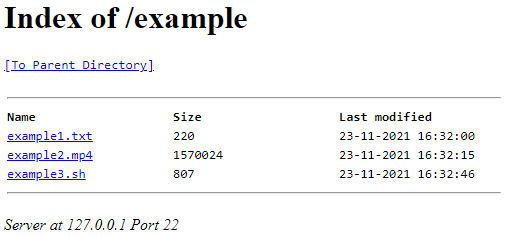

# SFTP Directory Browsing
A single file PHP script to browse (external) SFTP servers like old FTP directory listings in browsers or HTTP servers without an index.

This script doesn't serve files, because my goal was to be able to copy direct SFTP links for use in other apps like VLC Media Player. This means you can only see what files are in folders, but with small tweaks to the script the library used provides file streaming and serving too. You don't need full SSH access to the server and you can host it anywhere, because it works with remote servers too. But keep in mind that if the server is local-only, you need to host this script in your local network too of course.

You need to download phpseclib, put this script in the phpseclib folder and serve that with a PHP-enabled webserver. This library makes it a little less "single file", but is much more efficient than using a bulky script created with plain php_ssh2 for example.

Logging in can be done in multiple ways, but it happens with $\_GET by default. This way you can easily access multiple servers quickly, without the need for multiple files.
```
index.php?user=USERNAME&pass=PASSWORD&ip=IPADDRESS&port=PORT
```

## Dependencies:
* [phpseclib (tested with 1.0.19)](http://phpseclib.sourceforge.net/)
* A webserver with PHP

## Screenshots
